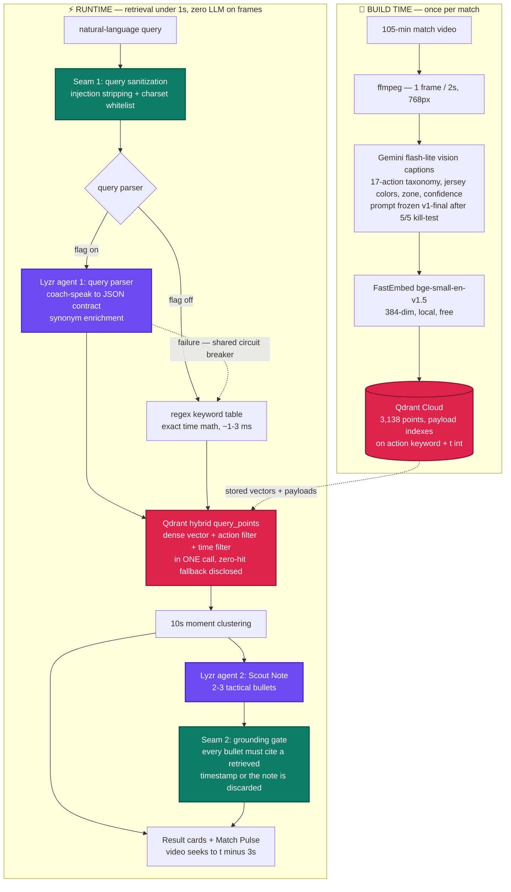

# FilmFinder ⚽🔍

### Ctrl+F for game film — type what happened in plain English, click, and the match video jumps there.


🔗 **Live demo:** https://filmfinder-3w3t24wvvcf7xsbgj32jhx.streamlit.app

**One-click tours** — every search and every moment is a shareable URL (`?q=<query>&t=<seconds>`):

[a goal past the diving keeper](https://filmfinder-3w3t24wvvcf7xsbgj32jhx.streamlit.app/?q=goal&t=5224) ·
[when did the keeper mess up](https://filmfinder-3w3t24wvvcf7xsbgj32jhx.streamlit.app/?q=when+did+the+keeper+mess+up) ·
[players arguing with the referee](https://filmfinder-3w3t24wvvcf7xsbgj32jhx.streamlit.app/?q=players+arguing+with+the+referee) ·
[shots in the last 10 minutes of the first half](https://filmfinder-3w3t24wvvcf7xsbgj32jhx.streamlit.app/?q=shots+in+the+last+10+minutes+of+the+first+half)

---

## The problem

Finding one moment in a recorded match means scrubbing through 90+ minutes of video. A coach who wants to review every corner, every save, or the goal their team conceded has no search box — just a timeline slider and patience.

**FilmFinder turns a match video into something you can search like a document.** Type what happened in plain English — `"corner kick"`, `"when did the keeper mess up"` — and the video jumps to that exact moment. No tagging, no fixed vocabulary, no cost beyond a YouTube link.

One full match indexed for this demo: **AFC Bournemouth 4–3 Liverpool** (CC-BY, official club channel) — all 105 minutes, **3,138 captioned frames**. Built solo in 4 days, entirely on free tiers.

## What a coach can do with it

- **🔍 Search like you talk** — `"saves in the last 10 minutes"` becomes a semantic vector + a hard `action=save` filter + a time window computed off the *measured* kickoff/halftime boundaries (`last 10 minutes → t ≥ 5675s`), fused in one Qdrant query.
- **📊 Match Pulse** — a clickable Altair timeline drawing all 3,138 frames as action-colored ticks across the full match. Search results ignite as markers; clicking one seeks the video.
- **✨ More like this** — one click on any result finds similar moments via Qdrant's Recommendation API, searching by the moment's own stored vector. No typing, no re-embedding: click one corner routine, get that team's whole set-piece pattern.
- **📎 Clip board → session plan** — save moments across searches, export `session_plan.md` where every line is a timestamped `youtu.be` deep link you can paste straight into the team chat.
- **📋 Scout Note** — a Lyzr agent writes 2–3 tactical bullets about the retrieved moments, behind a code-enforced grounding gate (see below).
- **🎲 Surprise pill** — one tap runs a long-tail query, because the index answers phrasings nobody pre-tagged.
- **📈 Clickable match overview** — 14 corners, 33 shots and more, derived from captions and honestly labeled *moments, not official stats*; each stat is itself a search.
- **🔬 X-ray mode** — a sidebar toggle for judges: the parsed query contract, the exact Qdrant filter JSON, per-stage millisecond latencies, and per-card similarity bars. It's the architecture diagram below, live.
- **🔗 Shareable everything** — deep links, dark film-room theme with a CVD-validated palette, and a seek that keeps your volume (YouTube postMessage bridge — the player never remounts).

## How it works

**The core trick:** captions, not video embeddings, are the index. At query time **no LLM ever touches a frame** — that's why retrieval is sub-second and hosting is free-tier.



<p align="center"><b>Diagram key:</b> 🔴 Qdrant &nbsp;·&nbsp; 🟣 Lyzr agents &nbsp;·&nbsp; 🟢 guardrail seams</p>

The design rule throughout: **the deterministic core never depends on an external API being up.** Flags + plain-Python fallbacks + a shared circuit breaker (3 failures → 10-min cooldown → half-open probe) + a validation layer between every agent and the UI.

## Under the hood

| Tech | Status | What it does here | Where |
|---|---|---|---|
| **Qdrant** 🔴 | **Live, load-bearing** | **Hybrid retrieval in one `query_points` call** — dense vector + `action` keyword filter + `t` time-range filter, backed by payload indexes on a 3,138-point collection. **Recommendation API** powers More-like-this (recommend by stored point vector — no re-embed, no query text). **Scroll API** renders the Match Pulse strip and caption-derived match stats. Zero-hit queries drop the action filter and *tell the user they did*. The product does not exist without Qdrant. | [`search.py`](search.py) · [`stats.py`](stats.py) · [`indexer.py`](indexer.py) |
| **Lyzr Agent Studio** 🟣 | **Live, behind flags** | **Two agents, both created programmatically via the v3 REST API.** Agent 1: query parser — natural language → exact JSON retrieval contract, handling compound time phrases and synonym enrichment (`"keeper mess up"` → `"goalkeeper mistake error fumble"`). Agent 2: Scout Note — 2–3 tactical bullets over retrieved moments. Both with plain-Python fallbacks and a shared circuit breaker — because a dead API is a latency tax: an exhausted account doesn't fail fast, it costs the full request timeout on every search. `lru_cache` + `st.cache_data` memoization protects credits. A Lyzr outage degrades capability, never availability. | [`lyzr_parser.py`](lyzr_parser.py) · [`scout_note.py`](scout_note.py) · [`lyzr_guard.py`](lyzr_guard.py) |
| **Guardrails** 🟢 | **Live, self-built** | Seam 1: query sanitization (injection-phrase stripping + charset whitelist, disclosed in the UI when triggered). Seam 2: the Scout Note grounding gate — every bullet must cite a timestamp present in the actual retrieved set, or the whole note is discarded and a deterministic summarizer takes over. Both are policy-shaped functions with the exact signatures a hosted guardrails API (e.g. Enkrypt) can drop into without touching call sites. | [`guardrails.py`](guardrails.py) |

## Measured performance

Repeatable harness ([`qa_eval.py`](qa_eval.py) → [`eval_results.md`](eval_results.md)), 13-case gold set — 12 scored + 1 documented expected miss — production config (Lyzr parser on):

| Metric | Result |
|---|---|
| Rank-1 hits | **12/12 scored** |
| hit@6 | **12/12** |
| MRR | **1.00** |
| The expected miss | counterattacks — per-frame captions can't see transitions; kept on the scoreboard, excluded from scoring |
| Earlier manual pass | 9/10 ([`QA.md`](QA.md)) |
| Embed latency | ~8 ms |
| Qdrant round-trip | ~170 ms |
| Keyword parse | ~1–3 ms |
| Lyzr parse | ~1–3.5 s first run, then cached |

Don't take the table's word for it: flip on **X-ray mode** in the live app's sidebar and watch per-stage millisecond timings, the parsed contract, and the exact Qdrant filter JSON on your own queries.

**The harness earned its keep on day one:** it caught the Lyzr parser agent doing "last 10 minutes" arithmetic wrong (a 60-second window). The fix is a design principle now baked in — the deterministic parser's exact time math overrides the agent's whenever it recognizes a time phrase. *LLMs keep the semantics; regex keeps the arithmetic.* Full story in [`QA.md`](QA.md).

## Hallucination policy

The only free text an LLM contributes at runtime is the Scout Note, and it passes a code-enforced gate: any bullet citing a timestamp outside the retrieved set kills the entire note, and a grounded-by-construction deterministic summarizer takes over. You can't prompt-engineer your way to a guarantee; you can enforce one. Captions carry per-frame `confidence` and `prompt_version` for auditability. The caption prompt was frozen only after a 5/5 kill-test ([`KILLTEST.md`](KILLTEST.md)).

<details>
<summary><b>⚔️ War stories — what broke in 4 days and what it taught the code</b></summary>

- **Gemini's 500 req/day cap hit mid-run** → resumable JSONL caption cache + quota-reset scheduling. The resume drill — kill the captioner mid-run, relaunch, zero duplicate frames — is documented in [`KILLTEST.md`](KILLTEST.md).
- **Groq vision's 3-image/8k-TPM limits** discovered under load → demoted from co-captioner to gap-filler.
- **Lyzr's create API silently drops `system_prompt`** → agents rebuilt with `agent_role`/`instructions` fields.
- **Caption counts inflated by broadcast replays** → measured merge gaps at 4/8/12/20s and relabeled the overview honestly: *moments, not official stats*.

</details>

## Quick start (dev)

```bash
python3.11 -m venv venv && source venv/bin/activate
pip install -r requirements.txt
cp .env.example .env        # fill in your keys
python verify_keys.py       # every key verified with a real call
```

Full pipeline — extract, caption, index, run:

```bash
python extract_frames.py --video match01.mp4 --out frames/match01
python captioner.py --frames-dir frames/match01 --out captions_match01.jsonl
python indexer.py --captions captions_match01.jsonl --collection filmfinder_match01
python search.py "corner kick" --collection filmfinder_match01   # CLI sanity check
streamlit run app.py
```

## Roadmap

Self-hosted deployment is the point of building on an open stack: local Qdrant + local FastEmbed + club-owned captions means **youth-team footage never leaves club hardware** — only the coach's queries move. Then multi-match corpora and CLIP dual-vector search. We built the retrieval engine, not a wrapper around someone else's.

## Footage & attribution

Match footage: **AFC Bournemouth 4–3 Liverpool**, official club channel, **Creative Commons Attribution** — verified on access (2026-07-15). Full details in [`ATTRIBUTION.md`](ATTRIBUTION.md). Code: MIT ([`LICENSE`](LICENSE)).

## Stack

Python 3.11 · Streamlit 1.59 · Qdrant Cloud · Lyzr Agent Studio · Gemini flash-lite · FastEmbed (BAAI/bge-small-en-v1.5) · Altair · ffmpeg · GitHub Actions

---

*Built solo in 4 days on free tiers. Every number above is measured.*
